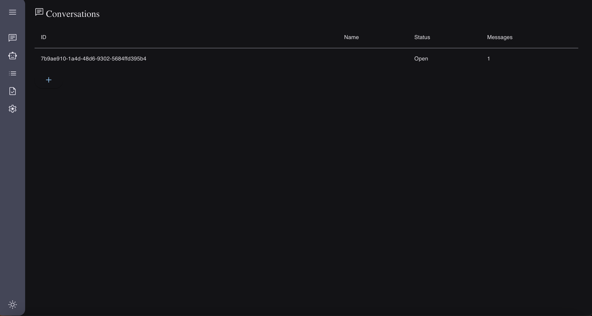

# Awesome-A2A (Agent2Agent Protocol) 

  
  
<em>A2A Protocol: Enabling communication between different agent frameworks</em>

  

    <a href="https://storage.googleapis.com/gweb-developer-goog-blog-assets/original_videos/A2A_demo_v4.mp4">
      <strong>▶️ Watch the A2A Protocol Demo Video</strong>
    </a>
  

## Overview

🔥 **Agent2Agent (A2A) Protocol** is an open standard by Google that enables seamless communication and interoperability between AI agents built on different frameworks or by different vendors. It allows agents to discover each other, negotiate interaction methods, and collaborate on tasks efficiently.  

This curated list provides everything you need to **quickly understand, run, and explore A2A**, including demonstrations, use cases, core concepts, and learning resources.

## 📋 Contents

- [Overview](#overview)
- [Sample Implementations Demo](#-sample-implementations-demo)
  - [JavaScript/TypeScript Agents](#-javascripttypescript-agents)
  - [Python Agents](#-python-agents)
  - [Hosts](#-hosts)
  - [Demo Application](#-demo-application)
- [Core Concepts](#-core-concepts)
- [How to Get Started](#-how-to-get-started)
- [FAQ](#-faq)
- [Resources](#-resources)
- [Contributing](#-contributing)

## 🚀 Sample Implementations Demo

### 🤖 JavaScript/TypeScript Agents
*   **[Movie Agent](https://github.com/google/A2A/tree/main/samples/js/src/agents/movie-agent)**: This agent uses the TMDB API to answer questions about movies.

    
    
    
    
<em>Movie Agent: Agent interface, Host CLI interaction, and AgentCard JSON</em>

*   **[Coder Agent](https://github.com/google/A2A/tree/main/samples/js/src/agents/coder)**: This is a simple code-writing agent that emits full code files as artifacts.

### 🐍 Python Agents
*   **[LangGraph](https://github.com/google/A2A/tree/main/samples/python/agents/langgraph)**: Sample agent which can convert currency using tools. Showcases multi-turn interactions, tool usage, and streaming updates.
*   **[CrewAI](https://github.com/google/A2A/tree/main/samples/python/agents/crewai)**: Sample agent which can generate images. Showcases multi-turn interactions and sending images through A2A.
*   **[Google ADK](https://github.com/google/A2A/tree/main/samples/python/agents/google_adk)**: Sample agent to (mock) fill out expense reports. Showcases multi-turn interactions and returning/replying to webforms through A2A.

### 🧰 Hosts
*   **[CLI](https://github.com/google/A2A/tree/main/samples/python/hosts/cli)**: Simple command-line client to interact with any A2A agent. Supports streaming and optional push notification listening.
*   **[Multi-Agent Orchestrator](https://github.com/google/A2A/tree/main/samples/python/hosts/multiagent)**: An ADK-based "Host Agent" that manages connections to other A2A agents and delegates tasks based on instructions.

### 🖥️ Demo Application
*  This demo application showcases agents talking to other agents over A2A.

    
    
    
<em>Demo Application: Command-line start up and web interface for multi-agent orchestration</em>

## 🧠 Core Concepts
*   **Agent Discovery:** Clients find agents and their capabilities by fetching the [`AgentCard`](https://google.github.io/A2A/#/documentation?id=agent-card) JSON.
*   **Task Lifecycle:** Tasks progress through states defined in [`TaskState`](https://google.github.io/A2A/#/documentation?id=core-objects).
*   **Communication:** Uses `Message` objects containing `Part`s (text, file, data). Task outputs are represented as `Artifact`s, also containing `Part`s.
*   **Streaming:** Long-running tasks can provide real-time updates using SSE via [`tasks/sendSubscribe`](https://google.github.io/A2A/#/documentation?id=streaming-support). Updates are sent as `TaskStatusUpdateEvent` and `TaskArtifactUpdateEvent`.
*   **Push Notifications:** Agents can proactively notify clients about task updates using webhook URLs provided via [`tasks/pushNotification/set`](https://google.github.io/A2A/#/documentation?id=set-task-push-notifications). 
*   **Authentication:** Defined in `AgentCard` and `PushNotificationConfig`. Can involve various schemes (e.g., API keys, OAuth, JWT). 
*   **Forms:** Structured data can be requested and submitted using `DataPart` within Messages/Artifacts (demonstrated in ADK sample).

## 🛠️ How to Get Started
* Run and Experience A2A Demo ([Sample Implementations Demo](#-sample-implementations-demo))
* Study Core Concepts ([Core Concepts](#-core-concepts))
* Reference Common Libraries to build your own A2A Agent
    - JavaScript/TypeScript ([Client](https://github.com/google/A2A/tree/main/samples/js/src/client)/[Server](https://github.com/google/A2A/tree/main/samples/js/src/server))
    - Python ([Common](https://github.com/google/A2A/tree/main/samples/python/common))
* Dive into Documentation to understand A2A in depth ([Official A2A Documentation](https://google.github.io/A2A))

## ❓ FAQ 
🔹 **Is A2A another implementation of MCP?**  
No, A2A (Agent2Agent Protocol) and MCP (Model Context Protocol) serve different purposes and are complementary. MCP standardizes how AI agents connect to external tools, data sources, and resources, facilitating seamless integration with various services. In contrast, A2A focuses on enabling direct communication and collaboration between AI agents themselves, allowing them to interact in their natural modalities. Together, MCP and A2A enhance the interoperability and functionality of AI systems by connecting agents to both external resources and to each other.

## 📚 Resources
* [Github: google/A2A](https://github.com/google/A2A)
* [Official A2A Documentation](https://google.github.io/A2A)
* [Official A2A Blog](https://developers.googleblog.com/en/a2a-a-new-era-of-agent-interoperability/)
* [Official A2A llms.txt](https://raw.githubusercontent.com/google/A2A/refs/heads/main/llms.txt)
* [JSON-RPC 2.0](https://www.jsonrpc.org/specification)

## 🤝 Contributing

We welcome contributions! Please read the [CONTRIBUTING.md](CONTRIBUTING.md) file for details.

---

## 📣 Stay Updated

For the latest updates on Awesome-A2A and related resources, follow us on Twitter: [@aidev_community](https://x.com/aidev_community)

